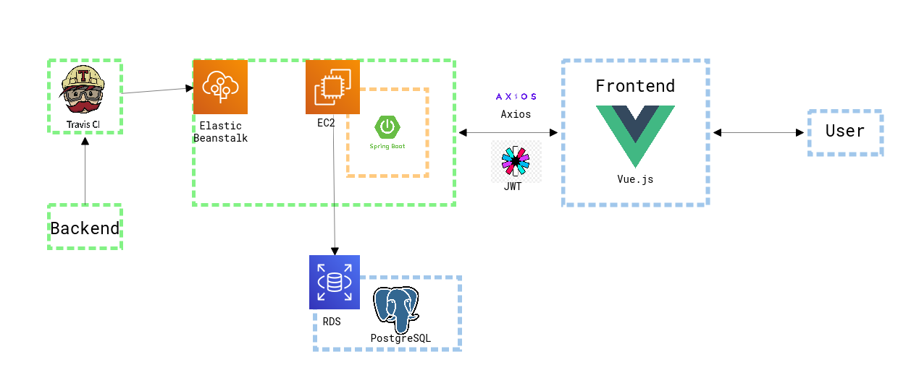

## Juhee Fred Lee / 이주희
안녕하세요! 만들고 개선해 나가는 것이 재밌어서 개발자가 되기로 한 이주희입니다.
대학에서 국제통상학을 전공하면서 왜 꼭 정해진 절차대로만 문제를 해결해야 할까? <b><i>나의 논리를 기술적으로 풀어내어 서비스를 만들고 개선하면 재밌지 않을까?</i></b> 하는 생각을 가지게 되며 개발자의 길에 접어들게 되었습니다! <b>느려도 우직하게</b>, <b>제일 편한 날은 오늘</b>이라는 생각으로 성장해가는 중입니다.💪💪💪
ng 
 
 

## How I develope! / 이런 개발을 하고 싶어요!
<ul>
    <li>개발은 재밌어야 한다고 생각합니다! 배움에서의 기쁨과 성능을 개선시킬때의 성취감은 저의 원동력입니다!🔥</li>
    <li>문제에 대한 이해와 기술을 적용하는 이유에 대한 확신을 가지고 코드를 작성합니다. 중요한 것은 문제를 해결하는 것이니까요! 🕵️</li>
    <li>개발과 성장은 절대 혼자 하는 것이 아니라 생각합니다! 늘 배우는 자세로 팀에 헌신하는 마음을 가지고 프로젝트에 임합니다.🙇‍♂️</li>
    <li>기록을 하면 기억력이 10배는 좋아진다고 생각하고 개발을 합니다! 공유할 수 있다면 더 큰 기쁨이라고 생각하고요!📝</li>
</ul>
 
 

## How I solve problems! / 문제는 이렇게 해결하려고 해요!
<ul>
    <li>문제 인지: 디버깅을 통하여 문제 발생의 원인, 현재 개발 지식으로 해결할 수 있는지에 대한 여부 등에 대하여 고민합니다.</li>
    <li>문제 해결을 위한 학습: 기술 스택의 문제일 경우 공식문서와 구글링을 통하여 학습을 진행하고, 설계와 관련된 부분일 경우 주로 서적이나 성공적인 레퍼런스를 참고하는 편입니다. 학습이 완료된 후 미니 프로젝트를 만들어 적용해보여 다시 한 번 이해여부를 확인합니다.</li>
    <li>해결 방안 적용: 학습한 내용들을 적용하여 문제를 해결합니다.</li>
    <li>기록: 기록하지 않을 경우 또 다시 문제를 맞이할 수 있더라고요!🤣 상기의 이유료 해당 프로세스를 기록하려고 합니다!</li>
</ul>
 
 

## :books:Tech Stacks:books:

> ### Strong

  
  
  
  
   

 

> ### Knowledgeable

  
  
  
   
  
  
   

 

> ### Experienced

  
  
  
  

 

> ### Tools

  
  
   
  
  
   

### 🦾Stats

  

 
 

## Projects I've working on / 프로젝트 내역
<ul>
    <li>워크토크: 사무공간 렌탈 플랫폼
      <ul>
        <li>기간: 2022.11 ~ 2022.12</li>  
        <li>프로젝트 설명: 사무공간을 대여하고 결제하는 웹 서비스입니다.</li>  
        <li>사용기술
          <ul>
            <li>개발언어/프레임워크: Java11 + SpringBoot 2.XX</li>
            <li>배포: Travis CI + AWS (EC2, S3)</li>
            <li>DB: PostgreSQL + Redis(Cache)</li>
          </ul>
        </li>  
        <li>담당파트(백엔드, 배포)
          <ul>
            <li>인증(Spring Security)</li>
            <li>결제 (Iamport)</li>
            <li>예약 (Redis, ElasticCache, Redisson)</li>
            <li>페널티</li>
            <li>마일리지</li>
            <li>백오피스</li>
            <li>어드민</li>
            <li>배포(Travis CI, EC2, S3)</li>
          </ul>
        </li>
        <li>프로젝트 아키텍처 </li> 
      </ul>
    </li>
</ul>
 
 